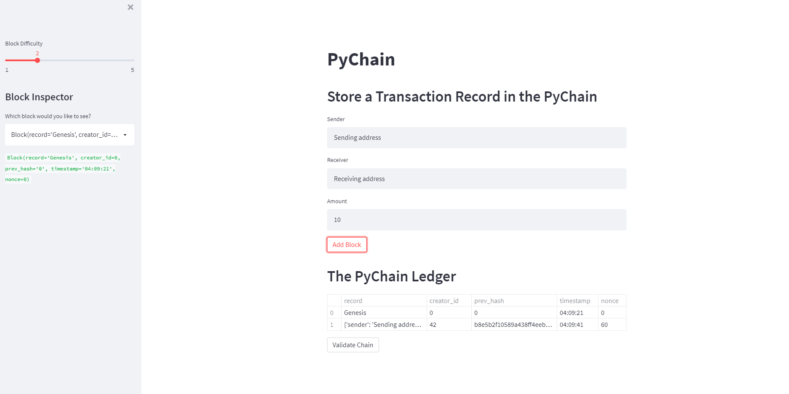
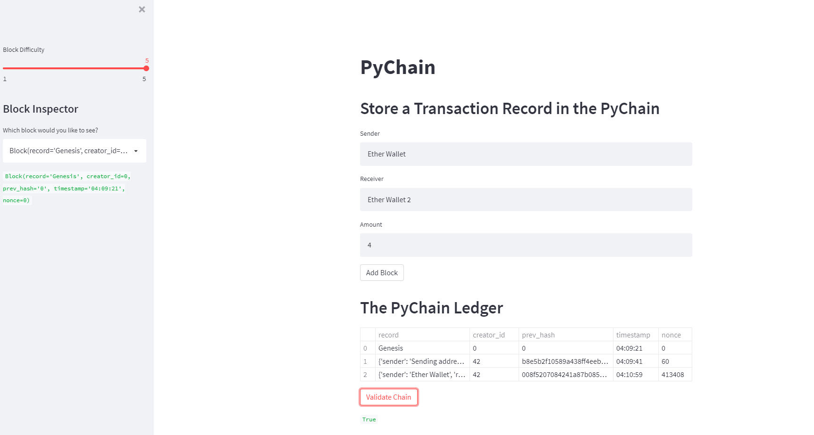

# Blockchain Application

This project allowed the creation of an online blockchain application using proof of work as the consensus algorithm. The inputs into each block were: sender, receiver, amount, creator ID, timestamp, previous hash and nonce. These inputs were used to create a hash and perform proof of work given the level of mining difficulty. All output is visually displayed in a web application using streamlit.

---

## Technologies

This program utilizes Python 3.7 with the following packages:

- [streamlit](https://streamlit.io/) to create a visual web application
- [typing](https://docs.python.org/3/library/typing.html) to store the blockchain in a List
- [dataclass](https://docs.python.org/3/library/dataclasses.html) to create a data class structure
- [datetime](https://docs.python.org/3/library/datetime.html) to record the time of each block
- [pandas](https://pandas.pydata.org/) for formation of blockchain dataframe
- [hashlib](https://docs.python.org/3/library/hashlib.html) to use the SHA 256 algorithm

---

## Installation guide

Install streamlit using the following pip command:

```python
  pip install streamlit
```

---

## Usage

To use the application, clone the repository and run the application with the following command:

```python
  streamlit run pychain.py
```

If you are asked to enter an email address, you may need to update your version of streamlit or use the following workaround:

```python
  streamlit run pychain.py --server.headless=true
```

---

## Application

Below are sample blocks mined from the application:


Block 1:



Block 2 with higher difficulty toggle:


---

## License

MIT